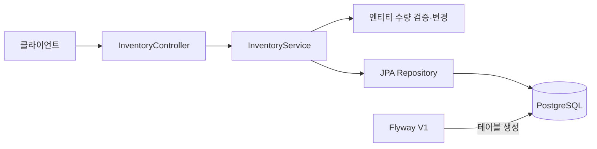

# 재고 관리 API

## 1. 프로젝트 소개 (Introduction)

동시에 들어오는 입출고 요청에서도 재고를 정확히 관리하기 위해 만든 Spring Boot 기반 재고 관리 API입니다.

## 2. 주요 기능 (Key Features)

- **상품 자동 등록**: 처음 입고하는 상품을 등록하고 SKU를 자동 발급합니다.
- **입고·출고 처리**: 재고를 증감하고 재고 부족이나 수량 상한 초과를 차단합니다.
- **현재 재고 조회**: 상품 ID로 기본 창고의 재고를 확인합니다.
- **입출고 이력 저장·조회**: 수량 변경과 이력을 함께 저장하고 상품별로 페이징 조회합니다.
- **동시 요청 처리**: 상품·창고별 재고 행에 비관적 락을 적용해 동시 변경을 처리합니다.

현재 API는 기본 창고(`DEFAULT`)를 사용합니다. 창고 선택 API는 아직 제공하지 않습니다.

## 3. 기술 스택 (Tech Stack)

| 구분 | 기술 |
| --- | --- |
| 언어 | Java 17 |
| 프레임워크 | Spring Boot 4.1.1, Spring MVC |
| 데이터 접근·검증 | Spring Data JPA, Bean Validation |
| 데이터베이스 | PostgreSQL 17 |
| 스키마 관리 | Flyway |
| 코드 생성 | Lombok |
| 빌드 | Gradle Wrapper |
| 테스트 | JUnit, Mockito, AssertJ, Testcontainers |
| 로컬 DB 실행 옵션 | Docker Compose |

## 4. 시작 가이드 (Getting Started)

Java 17과 Git이 필요합니다. PostgreSQL 17은 기존 로컬 설치 또는 Docker Compose 중 하나를 사용합니다.
단위 테스트는 Docker 없이 실행할 수 있으며, DB 통합 테스트에는 Docker가 필요합니다.
아래 명령은 macOS/Linux 셸 기준입니다.

### 1. 저장소 복제

```bash
git clone https://github.com/junho0831/deepFine.git
cd deepFine
```

Gradle은 프로젝트의 Wrapper를 사용하므로 별도 설치하지 않아도 됩니다.

### 2. DB 준비

#### 기존 PostgreSQL 사용

PostgreSQL이 실행 중이라면 관리자 계정으로 접속해 프로젝트용 계정과 DB를 생성합니다.
이미 준비돼 있다면 이 단계는 건너뜁니다.

```sql
CREATE ROLE inventory LOGIN PASSWORD 'inventory';
CREATE DATABASE inventory OWNER inventory;
```

기본 접속 정보는 `localhost:5432/inventory`, 계정·비밀번호는 로컬 개발용 `inventory`입니다.

#### Docker Compose 사용

별도 PostgreSQL이 없다면 프로젝트 루트에서 실행합니다.

```bash
docker compose up -d --wait
```

현재 Compose는 호스트의 `5432` 포트를 사용합니다. 이미 사용 중이면 기존 PostgreSQL을 이용하거나,
`compose.yaml`의 포트 매핑을 `127.0.0.1:55432:5432`로 바꾼 뒤 실행하고 아래 `DB_URL`도 맞춥니다.

### 3. 애플리케이션 실행

프로젝트 루트에서 실행합니다.

```bash
./gradlew bootRun
```

서버 시작 시 Flyway가 미적용 마이그레이션을 실행합니다. 빈 DB에서는 V1이
4개 테이블과 기본 창고(`DEFAULT`)를 생성하므로 SQL을 직접 실행할 필요가 없습니다.

기본 주소는 `http://localhost:8080`입니다. 실행 중인 터미널에서 `Ctrl+C`로 종료합니다.
접속 정보가 다르면 실행할 터미널에 환경 변수를 지정합니다. 예를 들어 DB 포트가 `55432`이면:

```bash
export DB_URL=jdbc:postgresql://localhost:55432/inventory
./gradlew bootRun
```

| 환경 변수 | 기본값 |
| --- | --- |
| `DB_URL` | `jdbc:postgresql://localhost:5432/inventory` |
| `DB_USERNAME` | `inventory` |
| `DB_PASSWORD` | `inventory` |
| `PORT` | `8080` |

테스트 없이 실행 JAR만 만들려면 `bootJar`를 사용합니다.
같은 터미널에 설정한 DB 환경 변수가 실행 시 적용됩니다.

```bash
./gradlew bootJar
java -jar build/libs/deepFine-0.0.1-SNAPSHOT.jar
```

테스트까지 검증하고 빌드하려면 `./gradlew build`를 실행합니다.
단위 테스트와 PostgreSQL 통합 테스트가 모두 포함되므로 Docker가 필요합니다.

Compose로 띄운 DB를 종료하려면 다음 명령을 사용합니다. 저장된 데이터는 유지됩니다.

```bash
docker compose down
```

### 4. API 호출

모든 요청은 기본 창고(`DEFAULT`)의 재고를 사용합니다. 아래 예시는 빈 DB에서 순서대로 실행하는 기준입니다.

#### 입고: `POST /api/products/receipts`

상품명으로 기존 상품을 찾습니다. 없으면 신규 상품 등록과 입고를 한 번에 처리합니다.
신규·기존 상품 모두 입고 완료 후 상품 정보와 `200 OK`를 반환합니다.

```bash
curl -i -X POST http://localhost:8080/api/products/receipts \
  -H 'Content-Type: application/json' \
  -d '{"name":"상품 A","quantity":10}'
```

```json
{"id":1,"name":"상품 A","quantity":10}
```

#### 출고: `POST /api/products/{id}/shipments`

아래 예시의 ID는 입고 응답의 `id`로 바꿔 사용합니다.

```bash
curl -i -X POST http://localhost:8080/api/products/1/shipments \
  -H 'Content-Type: application/json' \
  -d '{"quantity":3}'
```

```json
{"id":1,"name":"상품 A","quantity":7}
```

#### 재고 조회: `GET /api/products/{id}`

```bash
curl -i http://localhost:8080/api/products/1
```

```json
{"id":1,"name":"상품 A","quantity":7}
```

입출고 수량은 양의 정수여야 하며, 재고 부족은 `409`, 조회·출고 대상이 없으면 `404`를 반환합니다.
상세 입력 규칙과 오류 응답은 [설계 문서](docs/design.md#입력-규칙-및-오류)를 참고하세요.

#### 입출고 이력: `GET /api/products/{id}/movements`

```bash
curl -i 'http://localhost:8080/api/products/1/movements?page=0&size=20'
```

`page`는 0부터 시작하고 `size`는 1~100입니다. 기본값은 각각 0과 20입니다.
응답은 `items`, `page`, `size`, `totalElements`, `totalPages`를 포함합니다.
각 이력은 `id`, `type`, `quantityDelta`, `createdAt`을 제공하며 시각·ID 내림차순으로 정렬합니다.
입고 변경량은 양수, 출고 변경량은 음수입니다.

### 5. 테스트

DB 없이 단위 테스트와 MockMvc 기반 오류 응답 테스트를 실행합니다.

```bash
./gradlew test
```

서비스 테스트는 Repository를 Mockito로 대체하고 실제 엔티티의 업무 로직을 검증합니다.
Spring 애플리케이션이나 DB 서버를 실행하지 않습니다.

DB 통합 테스트는 Docker가 실행 중인 상태에서 별도로 실행합니다.
Testcontainers가 테스트 전용 PostgreSQL을 생성·정리하므로 로컬 개발 DB나 Compose DB를 준비할 필요는 없습니다.

```bash
./gradlew integrationTest
```

두 종류의 테스트를 모두 실행하려면 다음 명령을 사용합니다. `build`에도 이 검증이 포함됩니다.

```bash
./gradlew check
```

| 구분 | 코드 위치 | 테스트 보고서 |
| --- | --- | --- |
| DB 없는 테스트 | `src/test/java` | `build/reports/tests/test/index.html` |
| DB 통합 테스트 | `src/integrationTest/java` | `build/reports/tests/integrationTest/index.html` |

## 5. 프로젝트 아키텍처 (Architecture)

별도 화면이 없는 백엔드 API 프로젝트입니다. 요청은 컨트롤러·서비스·저장소를 거쳐 PostgreSQL에서 처리됩니다.



| 테이블 | 역할 |
| --- | --- |
| `product` | 상품 정보와 SKU |
| `warehouse` | 창고 정보 |
| `inventory` | 상품·창고별 현재 재고와 잠금 대상 |
| `stock_movement` | 입출고 이력 |

서비스의 트랜잭션 안에서 재고 행을 잠그고 수량 변경과 입출고 이력을 함께 저장합니다.

- [상세 설계: 테이블·락·트랜잭션·테스트·구현 범위](docs/design.md)
- [초기 테이블 생성 SQL](src/main/resources/db/migration/V1__create_product.sql)
