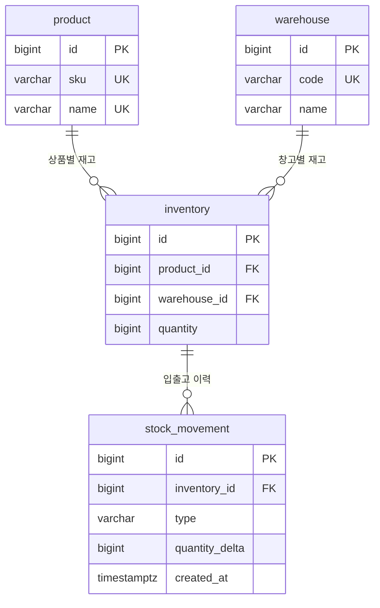

# 재고 관리 설계

실행과 API 사용법은 [README](../README.md)를 참고하세요.

## 기술 구성

Java 17, Spring Boot 4.1.1, Spring MVC, Bean Validation, Spring Data JPA,
PostgreSQL 17, Flyway, Lombok을 사용합니다. 테스트에는 JUnit, Mockito, AssertJ, Testcontainers를 사용합니다.

컨트롤러는 HTTP 입력 검증, 서비스는 트랜잭션과 흐름 제어,
엔티티는 수량 규칙, 저장소는 조회와 잠금을 담당합니다.
Flyway가 DDL을 관리하고 Hibernate는 `ddl-auto: validate`로 스키마를 검증합니다.
OSIV는 비활성화했습니다.
Lombok으로 서비스·컨트롤러의 주입 생성자와 엔티티의 기본 생성자·getter를 생성합니다.
엔티티 기본 생성자는 protected로 제한하고, 재고 수량 변경은 검증 메서드를 통해 처리합니다.
입출고 이력은 `receipt()`·`shipment()` 정적 팩토리로 생성합니다.
두 메서드는 양수 수량만 허용하며 출고의 음수 변경량 변환을 엔티티 안에서 처리합니다.

## 패키지 구조

`com.example.deepfine.inventory` 아래에서 역할별로 패키지를 분리합니다.

```text
inventory/
├── controller/  # HTTP 요청 처리와 입력 검증
├── service/     # 입출고 흐름과 트랜잭션 관리
├── repository/  # DB 조회, 잠금, 신규 등록
├── entity/      # 영속 엔티티와 재고 수량 규칙
├── dto/         # API 요청과 응답
└── exception/   # 업무 예외와 공통 오류 응답
```

## 동시성 및 정합성

### 테이블 구조



`inventory`의 `(product_id, warehouse_id)`에는 복합 UNIQUE 제약이 있습니다.
각 재고는 하나의 상품과 창고에 속하며, 입출고 이력은 해당 재고를 참조합니다.

| 테이블 | 역할 | 주요 제약 |
| --- | --- | --- |
| `product` | 상품 ID, SKU, 상품명 | SKU 유일성, 기존 API 호환용 상품명 유일성 |
| `warehouse` | 창고 코드와 이름 | 창고 코드 유일성 |
| `inventory` | 상품·창고별 현재 수량 | 상품+창고 유일성, 수량 0 이상, 외래 키 |
| `stock_movement` | 입고·출고 이력 | 재고 외래 키, 유형별 변경량 부호 검증 |

기존 API는 `DEFAULT` 기본 창고를 사용하고 요청·응답 형식을 유지합니다.
상품 자동 등록 시 `AUTO-<UUID>` SKU를 발급합니다. 상품 등록, 창고 배정 및 창고 선택 API는 아직 제공하지 않습니다.

### 입고

상품을 확인하고 없으면 `INSERT ... ON CONFLICT (name) DO NOTHING`으로 생성합니다.
상품·기본 창고의 `inventory` 행을 `@Lock(PESSIMISTIC_WRITE)`로 조회합니다.
최초 입고로 재고 행이 없으면 `(product_id, warehouse_id)` 유일성 제약과
`ON CONFLICT DO NOTHING`으로 0 재고 행을 확보한 뒤 다시 잠금 조회합니다.
잠긴 엔티티에서 상한을 검사한 뒤 수량을 늘리고 `RECEIPT` 이력을 저장합니다.
JPA 변경 감지가 트랜잭션 커밋 시 UPDATE를 수행합니다.

모든 단계는 같은 트랜잭션 안에서 실행되므로 이력 저장에 실패하면 수량 변경과 신규 등록도 롤백됩니다.
PostgreSQL 기본 READ COMMITTED에서 충돌 대기 후 다음 조회는 커밋된 재고를 볼 수 있습니다.

### 출고

상품 ID·기본 창고로 재고 행을 잠금 조회한 뒤 부족 여부를 검사하고 차감합니다.
`SHIPMENT` 이력의 `quantity_delta`에는 음수를 기록합니다.
다른 입출고 요청은 같은 재고 행의 잠금이 해제될 때까지 기다린 뒤 최신 수량을 읽습니다.
해당 재고가 없으면 404, 부족하면 409를 반환하며 실패한 출고 이력은 남기지 않습니다.

### 초기 스키마 관리

배포 전 초기 구조를 `V1__create_product.sql` 하나로 관리합니다.
V1에서 4개 테이블과 제약 조건, 인덱스, `DEFAULT` 기본 창고를 생성합니다.
재고 수량은 `inventory.quantity`에서만 관리하며, 기존 데이터 이관 및 복구용 컬럼은 없습니다.

이전 V1/V2가 적용된 개발 DB는 새 V1과 이력이 달라 그대로 실행할 수 없습니다.
보존할 데이터가 없는 개발 DB에 한해 초기화 후 새 V1을 적용합니다.
배포하거나 공유 DB에서 사용하기 시작한 이후에는 적용된 V1을 수정하지 않고 V2부터 변경 이력을 추가합니다.

### 트랜잭션 범위와 선택 이유

서비스의 `@Transactional`이 조회 잠금 → 업무 검증 → 수량 변경·이력 저장 → 커밋까지 묶습니다.
잠금은 트랜잭션 종료까지 유지됩니다. `@Transactional`만으로 갱신 유실을 막는 것은 아닙니다.
같은 상품·창고의 재고를 수정하는 모든 입출고 경로에서 동일한 재고 행을 잠가야 합니다.

동일 상품의 동시 변경을 기다린 뒤 처리하도록 비관적 락을 선택했습니다.
낙관적 락은 충돌 시 실패와 재시도 정책이 필요합니다. 비관적 락은 대기와 처리량 저하가 발생할 수 있어
트랜잭션을 짧게 유지하고 잠금 중 외부 API를 호출하지 않습니다.
현재는 상품 한 개만 변경하며, 여러 상품을 한 번에 잠그는 기능을 추가한다면 ID 순서 등 잠금 순서를 통일해야 합니다.

재고에는 DB CHECK 제약도 적용했습니다. 같은 PostgreSQL에 연결하면 여러 애플리케이션 인스턴스에서도 보호됩니다.
DB statement timeout은 5초, 연결 획득 제한도 5초입니다.
응답의 재고는 해당 연산의 결과이며 이후 다른 요청으로 변경될 수 있습니다.

공식 근거:

- [Spring Data JPA Locking](https://docs.spring.io/spring-data/jpa/reference/jpa/locking.html)
- [PostgreSQL 행 잠금](https://www.postgresql.org/docs/17/explicit-locking.html#LOCKING-ROWS)
- [PostgreSQL INSERT / ON CONFLICT](https://www.postgresql.org/docs/17/sql-insert.html)

초기 DDL: [V1__create_product.sql](../src/main/resources/db/migration/V1__create_product.sql)

## 입력 규칙 및 오류

- 상품명 앞뒤 공백은 제거합니다. 제거 후 1~100자이며 공백만 있는 이름은 허용하지 않습니다.
- MVP에서는 상품명을 고유 식별 기준으로 사용합니다. 대소문자와 내부 공백은 구분합니다.
- 입출고 수량은 `1`부터 `9223372036854775807`까지의 정수입니다. 현재 재고는 `0`도 허용합니다.
- ID는 양수여야 합니다. 잘못된 JSON, 누락된 필수 값, 소수 수량, 알 수 없는 필드는 거부합니다.
- 출고 요청량이 재고와 같으면 성공하며 재고는 `0`이 됩니다.

| HTTP 상태 | code | 상황 |
| --- | --- | --- |
| 400 | `INVALID_REQUEST` | 입력 검증 실패, 잘못된 JSON 또는 ID |
| 404 | `PRODUCT_NOT_FOUND` | 조회·출고 대상 상품 없음 |
| 409 | `INSUFFICIENT_STOCK` | 출고 재고 부족 |
| 409 | `STOCK_LIMIT_EXCEEDED` | 입고 후 BIGINT 범위 초과 |
| 503 | `DATABASE_UNAVAILABLE` | DB 연결 장애, 잠금 획득 실패 등 일시적 DB 오류 |
| 500 | `INTERNAL_SERVER_ERROR` | SQL 오류·예상하지 못한 제약 위반 등 서버 내부 오류 |

오류는 `application/problem+json`으로 반환합니다.
Bean Validation 입력 오류에는 `errors` 배열로 `field`와 `message`를 제공합니다.
예를 들어 수량 0은 `{"field":"quantity","message":"수량은 양수여야 합니다."}`로 안내합니다.
잘못된 JSON이나 타입 변환 실패는 기존 공통 400 응답을 사용하며 내부 파싱 정보는 노출하지 않습니다.
업무 오류 응답 예:

```json
{
  "type":"about:blank",
  "title":"Conflict",
  "status":409,
  "detail":"출고 가능한 재고가 부족합니다.",
  "instance":"/api/products/1/shipments",
  "code":"INSUFFICIENT_STOCK"
}
```

## 테스트에서 검증하는 동작

재고 엔티티 단위 테스트는 DB 없이 수량 증감, 전량 출고, 잘못된 수량,
재고 부족, 수량 상한 경계와 실패 시 수량 유지를 확인합니다.

`src/test/java`의 서비스 단위 테스트는 Spring 컨텍스트 없이 서비스를 직접 생성하고,
Repository를 Mockito로 대체합니다. 조회 결과, 신규 상품·재고 생성 분기,
재고 부족·상한 초과 시 이력 미저장과 정상 입출고 이력 전달을 확인합니다.
엔티티와 서비스 단위 테스트, MockMvc 기반 오류 응답 테스트는 `./gradlew test`로 실행합니다.
Mock 테스트는 실제 DB 잠금이나 트랜잭션 롤백을 검증하지 않습니다.

`src/integrationTest/java`의 DB 통합 테스트는 `./gradlew integrationTest`로 다음을 검증합니다.

- 실제 HTTP를 통한 신규·기존 입고 → 전량 출고 → 조회
- 미등록 상품 404, 재고 부족 409, 잘못된 입력 400
- 수량 상한 초과 시 재고 유지
- 동시 신규 입고 80건 → 상품 1행, 재고 80
- 재고 20개에 동시 출고 80건 → 성공 20건, 재고 부족 60건, 최종 재고 0
- 초기 재고 100개에 입고 50건(각 2개)·출고 50건(각 1개) → 최종 재고 150
- DB 자체의 음수 재고·중복 상품명 차단
- 이력 저장 실패 시 수량 변경·신규 상품 생성 롤백
- 출고 이력 저장 실패 시 HTTP 500 응답과 재고·이력 유지
- 커밋 시 재고 UPDATE 실패 시 먼저 저장한 이력도 롤백
- 여러 상품의 이력이 각 상품·기본 창고 재고에 연결되는지 확인
- 창고별 재고 분리와 외래 키·재고 중복·이력 변경량 제약
- 동시 입출고 후 이력 합계와 현재 재고 일치

동시성 테스트는 16개 워커를 시작 장벽으로 동시에 출발시키며, 각 요청이 별도 서비스 트랜잭션을 사용합니다.
모든 Future의 결과를 수집해 스레드 안의 실패가 테스트에서 누락되지 않게 했습니다.
통합 테스트 보고서: `build/reports/tests/integrationTest/index.html`.
`./gradlew check`와 `./gradlew build`는 DB 없는 테스트와 DB 통합 테스트를 모두 실행합니다.

## 구현 범위와 제한

- 상품마다 UNIQUE SKU를 보유하며 자동 등록 시 발급합니다. 현재 입고 API는 상품명으로 대상을 식별합니다.
- 상품·창고별 재고와 입출고 이력을 저장합니다. 현재 API는 기본 창고만 사용합니다.
- 상품 등록, 창고 관리·배정·선택, 이력 조회, 재고 조정 API는 아직 제공하지 않습니다.
- 목록·검색과 요청 멱등성은 구현하지 않았습니다.

상품명 변경이나 동명 상품을 지원하려면 API의 상품 식별 기준을 SKU 또는 상품 ID로 바꿔야 합니다.
입출고 POST를 반복하면 매번 반영되므로 응답 유실 후 자동 재시도는 중복 반영을 유발할 수 있습니다.
재시도가 필요해지면 요청 키와 처리 결과를 재고 변경과 같은 트랜잭션으로 저장하는 멱등성 처리가 필요합니다.
